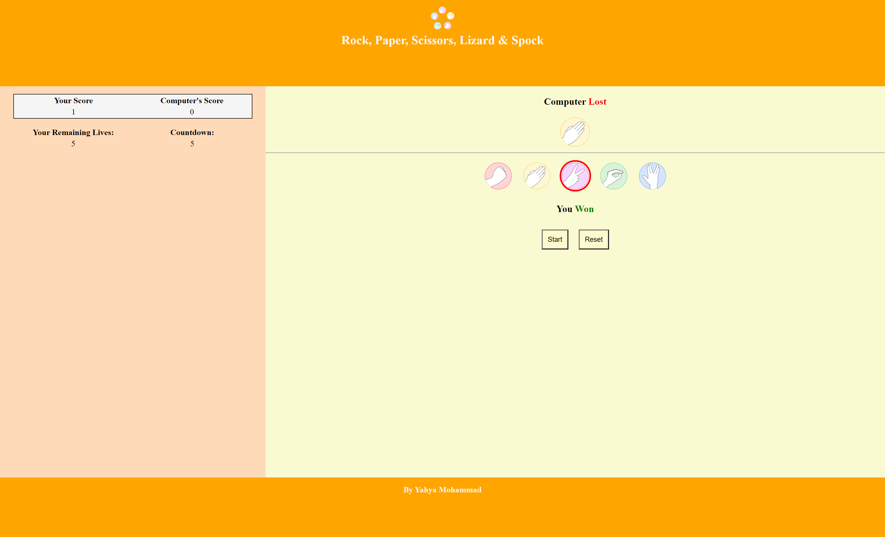

# Rock, Paper, Scissors, Lizard & Spock Game

This is a variation of the traditional rock, paper, scissors game including two more variables - Lizard and Spock!
This game is inspired by the hit TV show The Big Bang Theory.
Rules are as follows: "Scissors cuts paper, paper covers rock, rock crushes lizard, lizard poisons Spock, Spock smashes scissors, scissors decapitates lizard, lizard eats paper, paper disproves Spock, Spock vaporizes rock, and as it always has, rock crushes scissors" as explained by Sheldon in The Big Bang Theory.

My game is only playable against the computer and is not multiplayer. HTML, CSS and Javascript were used in the production of the game. 

## Responsive design

My website is fully responsive to different screen sizes as will be demonstrated below. 
I used media-query in CSS to make this possible. At a width of 768px or more, the score counter is stacked to the left of the main game, whilst at a width of less than 768px, the score counter stacks on top of the main game. 

Device Dimensions - 1722px x 1046px

Device Dimensions - 710px x 1110px

Device Dimensions - 398px x 902px

## Features

This is a single page website, meant only to play the game. 

The header and footer are purely design based and stay on the page throughout the play of the game.
The header contains the title of the game, as well as an icon of the game from the [Big Bang Theory Wiki Website](https://bigbangtheory.fandom.com/wiki/Rock,_Paper,_Scissors,_Lizard,_Spock)
The footer just contins the author name (Yahya Mohammad)

### Start Screen

The start screen entails the rule of the game, the same as explained in the opening of this readme file. 
Furthermore, it explains how there are 5 lives to play with against the computer.
Below the rules and conditions of the game, there is a "Get Started" button. Thanks to the use of Javascript, pressing this button begins the game and changes the layout of the page.

### Game Mode

Once the "Get Started" button is pressed, a table with a score counter appears as well as the game play interface. 

#### Score counter

The score counter shows that the player has 5 lives, and shows the score of the player vs computer. Upon playing the game, this keeps track of the score in real time. It also shows how many lives are remaining. In game play, the table also shows a countdown for user selection before winner/loser of the game is revealed. The aim is to score as highly against the computer as possible within the 5 lives. 

### The Game

The game interface is seperated into computer choice and user choice. Images are used to display the 5 options (Rock, Paper, Scissors, Lizard, Spock) for the user to select from and the rock image is shown on the computer side (to symbolise computer's selection)
Underneath this, there is a start and reset button.

The start button starts the game and timer. From clicking start, the user has 5 seconds to make their selection by clicking on an image on the user side of the game.This selection will be outlined red. The score table shows this 5 second countdown. 
Simultaneously, the computer picks it's choice randomly. This is represented by the alternating 5 images on the computer selection during the countdown. 

Upon the 5 seconds being up, the computer reveals whether or not the user/ computer won or lost the game. It keeps score of this on the scorer.

To play again, start must be pressed again.
The reset button, situated next to the start button, resets the score table and allows a fresh start to the game with 5 lives remaining. 

## Bugs/ Testing

Upon testing the game, I discovered that constantly spamming the start button can cause the game to malfunction. The countdown will not stop at 0 seconds and then reveal the winner/loser. Instead, the countdown goes into negative numbers and the winner/loser is not revealed. The webpage must be reloaded to stop this. 

I have not come to a conclusion as to the reason for this bug yet, and am in the process of finding how to resolve this. 

## Validation 

HTML - No errors were returned when passing through the official W3C validator
CSS - No errors were found when passing through the official (Jigsaw) validator
JS - No errors were found when passing through jshint.com

## Credits/ Sources

All code was written by me. 
Multiple youtube videos were used to understand the logic behind game making using javascript, but no code was copied. These were used for an understanding of logic only.
[FreeCodeCamp](https://www.freecodecamp.org/) was used to learn the javascript fundamentals.

The header picture (all.png) was sourced from https://bigbangtheory.fandom.com/wiki/Rock,_Paper,_Scissors,_Lizard,_Spock 
This same picture was seperated into the 5 user choice option pictures (Rock, Paper, Scissors, Lizard, Spock) using the windows paint application and image resizer. The same website also provided the rule of the game. 

## Deployment 

This website was deployed using Github pages.

By Yahya Mohammad. 

